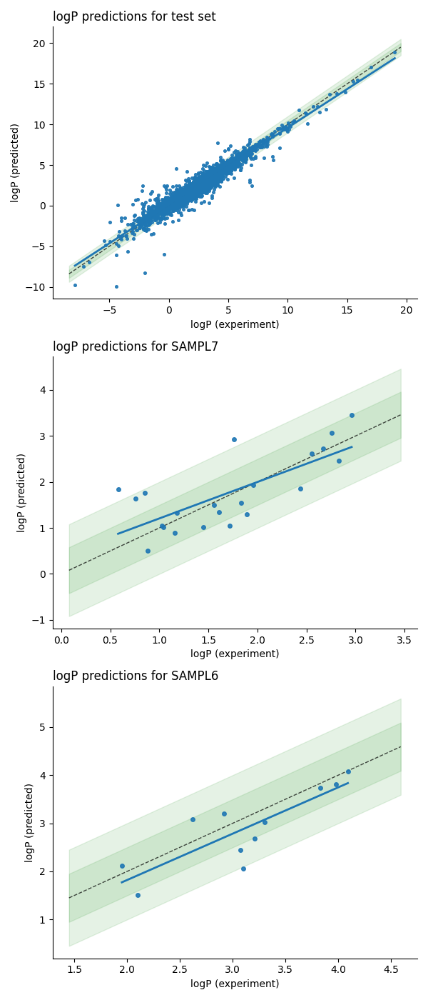

# logP prediction

This repository demonstrates the use of Spektral tensorflow library for the prediction of logP values from molecular structure, a QSPR model. logP values are predicted using an Edge-Conditioned Convolutional layers (ECC) and Attention Pooling from Spektral. This combination had a very good performance on several QSPR tasks I have tested and achieves SOTA results comparing to empirical and physical (e.g. QM) models in SAMPL6 and SAMPL7 challanges in logP prediction.

## logP dataset

    Dataset is provided in Spektral logP dataset class which 
    downloads and encodes logP datasets used for training and testing of logP 
    predictor models in the paper titled "Predicting partition coefficients for the 
    SAMPL7 physical property challenge using the ClassicalGSG method" by 
    Donyapour Nazanin and Dickson Alex. 
https://doi.org/10.1007/s10822-021-00400-x
    
    
    The datasets in SDF format are read and molecules are encoded as graphs. 
    Node features:
    - atom type (one-hot)
    - charge (value)
    - degree (value)
    - position (x, y, z)
    
    Edge features: single, double, triple or aromatic (one-hot encoded)

## Analysis of ECC-AttP on test datasets

Three test datasets are used:
- test set contains ~4k randomly selected molecules from 41k molecules in DB1.sdf file. 
- SAMPL7 contains 22 novel (recently synthesized) molecules
- SAMPL6 contains 16 molecules from previous challenge

| dataset | rmse | mae | r2 | kendall`s tau |
|----------|-------|-----|---------------|-|
| test set | 	0.60 	(0.37, 0.96) |	0.39 	(0.28, 0.53) |	0.93 	(0.83, 0.98) |	0.85 	(0.77, 0.90) |
| SAMPL7 |	0.55 	(0.38, 0.71) |	0.42 	(0.28, 0.58) |	0.54 	(0.23, 0.80) |	0.48 	(0.16, 0.74) |
| SAMPL6 |	0.48 	(0.32, 0.63) |	0.39 	(0.25, 0.53) |	0.70 	(0.36, 0.89) |	0.60 	(0.22, 0.89) |

## Comparison to best results in SAMPL7 challenge

| method  | rmse | mae | r2 | kendall`s tau |
|-----|-----|-----|---------------|-|
| **ECC-AttP (current)** |	0.55 	(0.38, 0.71) |	0.42 	(0.28, 0.58) |	0.54 	(0.23, 0.80) |	0.48 	(0.16, 0.74) |
TFE MLR | 	0.58 (0.34, 0.83) |	0.41 (0.26, 0.60) |	0.43 (0.06, 0.80) |	0.56 (0.23, 0.83) |
Chemprop |	0.66 (0.39, 0.89) |0.48 (0.30, 0.69) |	0.41 (0.11, 0.76) | 0.54 (0.25, 0.82) |
ClassicalGSG DB3 |	0.77 (0.57, 0.96) |	0.62 (0.43, 0.82) |	0.51 (0.18, 0.77) |	0.48 (0.14, 0.75) |
COSMO-RS  |	0.78 (0.49, 1.01)|	0.57 (0.36, 0.80) |	0.49 (0.17, 0.80) |	0.53 (0.25, 0.78)
TFE-NHLBI  |	1.55 (1.19, 1.87) 	|1.34 (1.02, 1.76) |	0.52 (0.19, 0.78) |	0.51 (0.19, 0.78) 

## Comparison to best results in SAMPL6 challenge

| method  | rmse | mae | r2 | kendall`s tau |
|-----|-----|-----|---------------|-|
| **ECC-AttP (current)** | 0.48 	(0.32, 0.63) |	0.39 	(0.25, 0.53) |	0.70 	(0.36, 0.89) |	0.60 	(0.22, 0.89) |
cosmotherm_FINE19 | 0.38 [0.23, 0.55] |0.31 [0.19, 0.46] | 0.77 [0.36, 0.94] | 0.64 [0.17, 1.00]
Global XGBoost-Based QSPR | 0.39 [0.28, 0.49] | 0.34 [0.23, 0.46] | 0.74 [0.40, 0.92] | 0.59 [0.12, 0.89]
EC_RISM_wet_P1w+2o | 0.47 [0.17,0.75] | 0.31 [0.15, 0.54] | 0.74 [0.33, 0.97] | 0.81 [0.46, 1.00]
RayLogP-II,  QSPR model | 0.49 [0.37, 0.61] | 0.44 [0.32, 0.57] | 0.74 [0.40, 0.94] | 0.67 [0.22, 1.00]
LogP_SMD_Solvation_DFT | 0.49 [0.33, 0.62] | 0.42 [0.26, 0.57] | 0.69 [0.35, 0.91] | 0.67 [0.27, 0.96]
